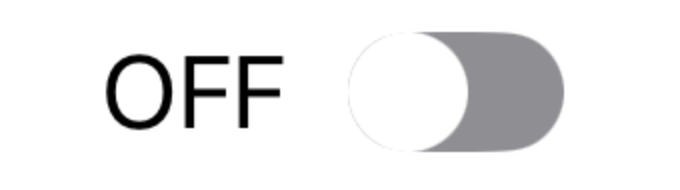
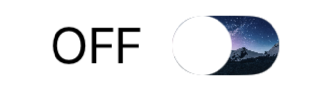
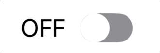

# CustomToggleView

### Requirements
* iOS 14.0+
* Xcode 13.0+
* Swift 5.5


### Content
* [기본적인 형태](#intro_usage_example)
* [Documentation](#documentation)
  * [Switch Modifier](#Switch_Modifier) 
     * [Custom](#custom)
     * [Switch Color](#changeColor)
     * [ReplaceCustomBackgroundView](#replaceCustomBackgroundView)
  * [Knob Modifier](#Knob_Modifier)
     * [KnobColor](#knobColor)
     * [KnobPadding](#knobPadding)
     * [AddViewAboveKnob](#addViewAboveKnob)


<a name="intro_usage_example"></a>
## 기본적인 형태

```swift
CustomToggleView(isOn: $state) {
    Text(state ? "ON" : "OFF")
}
```





<a name="documentation"></a>
# Documentation

CustomToggleView는 기본적인 ToggleView하고 동작은 같지만 자유도가 더 높습니다.   
Text와 Switch의 간격, Switch의 Size, Color, Background, Knob의 Size, Color, Overlay등 자유롭게 구현 가능합니다.


<a name="Switch_Modifier"></a>
## Switch Modifier

Switch에 관련된 Modifier들에 관한 내용입니다.

<a name="custom"></a>
### 1. Custom

#### `custom(model:ToggleModel) -> CustomToggleView`
Text와 Switch 사이의 Spacing, Switch의 Size, Switch의 CornerRadius, Switch의 isOn State에 따른 background Color를 정할 수 있는 Model를 적용시키는 Modifier.

##### ToggleModel
| Value | Description | Default |
|---------------------|:------------------:|---------|
| **spacing** | Text와 Switch의 간격 | 10 |
| **size** | Switch의 Size | CGSize(width: 36, Height: 20) |
| **radius** | Switch의 CornerRadius | 20 |
| **isOnColor** | isOn이 True일때, Switch의 Color | yellow |
| **isOffColor** | isOn이 False일때, Switch의 Color | gray |

ToggleModel은 기본적인 default value들을 가지고 있는데 만약 기본 style로 사용할 경우 custom Modifier을 적용안시켜도 된다.

##### Usage examples:

```swift
CustomToggleView(isOn: $state) {
    Text(state ? "ON" : "OFF")
}
.custom(ToggleModel(spacing: 20))
```

<a name="changeColor"></a>
### 2. Switch Color

#### `changeColor(on:Color,off:Color) -> CustomToggleView`
Switch의 isOn의 상태에 따라 Color을 바꿀 수 있다.

##### Usage examples:

```swift
CustomToggleView(isOn: $state) {
    Text(state ? "ON" : "OFF")
}
.changeColor(on: .blue, off: .white)
```

<a name="replaceCustomBackgroundView"></a>
### 3. ReplaceCustomBackgroundView

#### `replaceCustomBackgroundView<V: View>(@ViewBuilder content: @escaping () -> V) -> CustomToggleView`
Switch에 Color가 아닌 content closure에 구현한 View로 대체할 수 있다.

##### Usage examples:

```swift
let urlString: String = "https://images.unsplash.com/photo-1519681393784-d120267933ba?q=80&w=1000&auto=format&fit=crop&ixlib=rb-4.0.3&ixid=M3wxMjA3fDB8MHxleHBsb3JlLWZlZWR8Mnx8fGVufDB8fHx8fA%3D%3D"

CustomToggleView(isOn: $state) {
    Text(state ? "ON" : "OFF")
}
.replaceCustomBackgroundView {
    AsyncImage(url: URL(string: urlString)) { image in
        image.resizable()
    } placeholder: {
        EmptyView()
    }
    .frame(width: 36, height: 20)
    .clipShape(RoundedRectangle(cornerRadius: 12))
}
```




<a name="Knob_Modifier"></a>
## Knob Modifier

Knob에 관련된 Modifier들에 관한 내용입니다.

<a name="knobColor"></a>
### 1. KnobColor

#### knobColor()

knob의 Color를 바꾸는 Modifier

**Method:**

* **`knobColor(_ color: Color) -> CustomToggleView`**   
knob의 Color를 바꾼다

   ##### Usage examples:
  
    ```swift
    CustomToggleView(isOn: $state) {
           Text(state ? "ON" : "OFF")
    }
    .knobColor(.pink)
    ```

       


* **`knobColor(on: Color, off: Color) -> CustomToggleView`**   
knob의 Color를 isOn State에 따라 바꾼다.

   ##### Usage examples:

   ```swift
   CustomToggleView(isOn: $state) {
       Text(state ? "ON" : "OFF")
   }
   .knobColor(on: .pink, off: .blue)
   ```

      
   <br>
      
   <br/>

<a name="knobPadding"></a>
### 2. KnobPadding

#### knobPadding()

knob의 Padding을 적용시키는 Modifier.   
기본적으로 Padding을 적용안시키면 Switch의 Height이랑 같아서 Padding을 주고 싶을 떄 사용하면 된다.   
사용법은 padding() modifier랑 같다.

**Method:**

* **`knobPadding(_ edges: Edge.Set = .all, _ length: CGFloat = .zero) -> CustomToggleView`**   
knob에 padding을 적용시킨다.   
length을 입력 안할경우, 0으로 들어간다

   ##### Usage examples:

   ```swift
   CustomToggleView(isOn: $state) {
       Text(state ? "ON" : "OFF")
   }
   .knobPadding(.all, 2)
   ```
   
      

* **`isOnKnobPadding(_ edges: Edge.Set = .all, _ length: CGFloat = .zero) -> CustomToggleView`**   
isOn의 state가 true 일 때의 knob padding
length을 입력 안할경우, 0으로 들어간다

   ##### Usage examples:

   ```swift
   CustomToggleView(isOn: $state) {
       Text(state ? "ON" : "OFF")
   }
   .isOnKnobPadding(.all, 2)
   ```

      

* **`isOffKnobPadding(_ edges: Edge.Set = .all, _ length: CGFloat = .zero) -> CustomToggleView`**   
isOn의 state가 false 일 때의 knob padding   
length을 입력 안할경우, 0으로 들어간다

   ##### Usage examples:

   ```swift
   CustomToggleView(isOn: $state) {
       Text(state ? "ON" : "OFF")
   }
   .isOffKnobPadding(.all, 2)
   ```

      


<a name="addViewAboveKnob"></a>
### 3. AddViewAboveKnob

#### `addViewAboveKnob<V: View>(@ViewBuilder content: @escaping () -> V) -> CustomToggleView`
Knob 위에 CustomView를 적용시키고 싶을 때 사용한다.

##### Usage examples:

```swift
CustomToggleView(isOn: $state) {
    Text(state ? "ON" : "OFF")
}
.addViewAboveKnob {
    Image(systemName: "heart.fill")
        .resizable()
        .frame(width: 10, height: 10)
}
```


